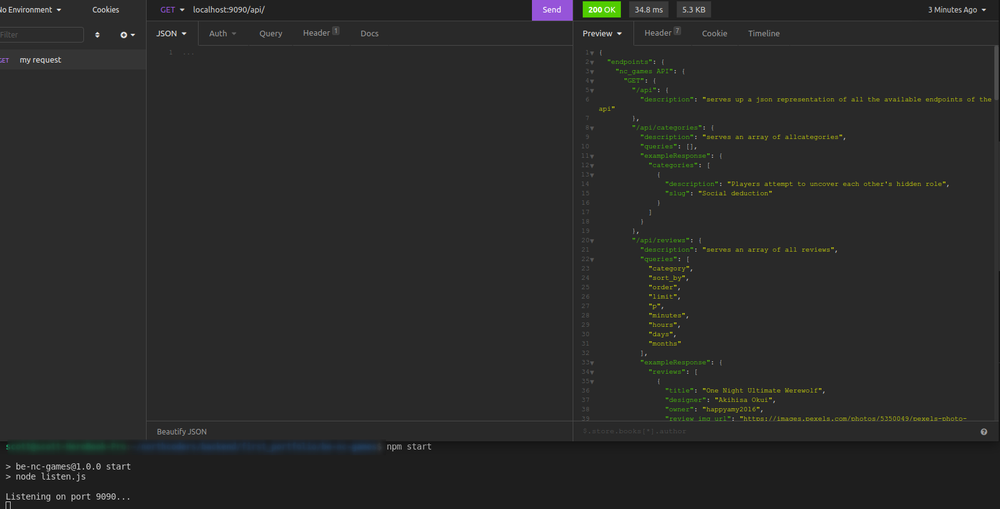

# nc-games-scott, Northcoders project

## Contents
- [Background](#background)
- [Technologies](#technologies)
- [Set-up](#setup)
- [Usage](#usage)
- [Complete list of endpoints](#endpoints)
- [Live version](#live)

## Background

The server is hosted on Heroku and is available to query [here](https://nc-games-scott.herokuapp.com/api/).

The source code can be viewed and downloaded from [github](https://github.com/Sgavinmills/nc-games-scott)

The server is intended to mimick a real world backend service. It is designed as a board-game review service, it contains tables for reviews, comments, users, categories and votes - all of which can be queried through the API. 

This project was created by me as part of the back-end section of the Northcoders bootcamp. This REST API was built using the MVC design pattern and was built using full TDD.

Database creation and seeding scripts are included in the github repository

## Technologies

- [Node.js](https://nodejs.org/en/) v14.17.4 LTS
- [Postgres](https://www.postgresql.org/) v13.0.0

### Dependencies:
- [Express.js](https://expressjs.com/) v4.17.1
- [Node-postgres](https://node-postgres.com/) v8.7.1
- [Dotenv](https://www.npmjs.com/package/dotenv) v10.0.0
- [pg-format](https://www.npmjs.com/package/pg-format) v1.0.4

### Dev dependencies
- [Jest](https://jestjs.io/) v27.06
- [Jest-sorted](https://www.npmjs.com/package/jest-sorted) v1.0.12
- [Supertest](https://www.npmjs.com/package/supertest) v6.1.4

## Setup

Follow these steps to download the project onto your own machine:

- Clone the repo
~~~
git clone https://github.com/Sgavinmills/nc-games-scott.git
~~~

- Install all dependencies
~~~
npm install
~~~

- Create `.env.test` & `.env.development` files and inside put `PGDATABASE=nc_games_test` & `PGDATABASE=nc_games` respectively. These env variables will ensure the correct databases are seeded when testing or running the server. 

- Create a test and development databases
~~~
npm run setup-dbs
~~~

- Seed the development database
~~~
npm run seed
~~~

## Usage

At this point the server can be started and the various endpoints can be queried at localhost on port 9090 using insomnia or your favourite alternative client.
~~~
npm start
~~~

Try sending a GET request to /api to see a list of available endpoints

Alternatively the test suite can be run:

~~~
npm test
~~~
The test suite will test the utility functions as well as server functions. You can run just the server tests
~~~
npm test app
~~~
The tests will use a test database with test data seeded before every test.

  ## Complete list of endpoints

GET /api will return a complete list of endpoints and descriptions in JSON format. 

  ### GET
  - GET /api
  - GET /api/categories
  - GET /api/reviews
  - GET /api/reviews/:reveiwid_or_title
  - GET /api/reviews/:review_id/comments
  - GET /api/users
  - GET /api/users/:username
  - GET /api/votes/:username/reviews
  - GET /api/votes/:username/comments
  - GET /api/comments/:username/reviews
  
  ### POST
  - POST /api/reviews/:review_id/comments
  - POST /api/reviews
  - POST /api/categories
  - POST /api/users
  
  ### PATCH
  - PATCH /api/reviews/:review_id
  - PATCH /api/comments/:comment_id
  - PATCH /api/users/:username

### DELETE
- DELETE /api/comments/:comment_id
- DELETE /api/reviews/:review_id

  

## Live Version
The live version of the server can be viewed on [Heroku](https://nc-games-scott.herokuapp.com/api/)